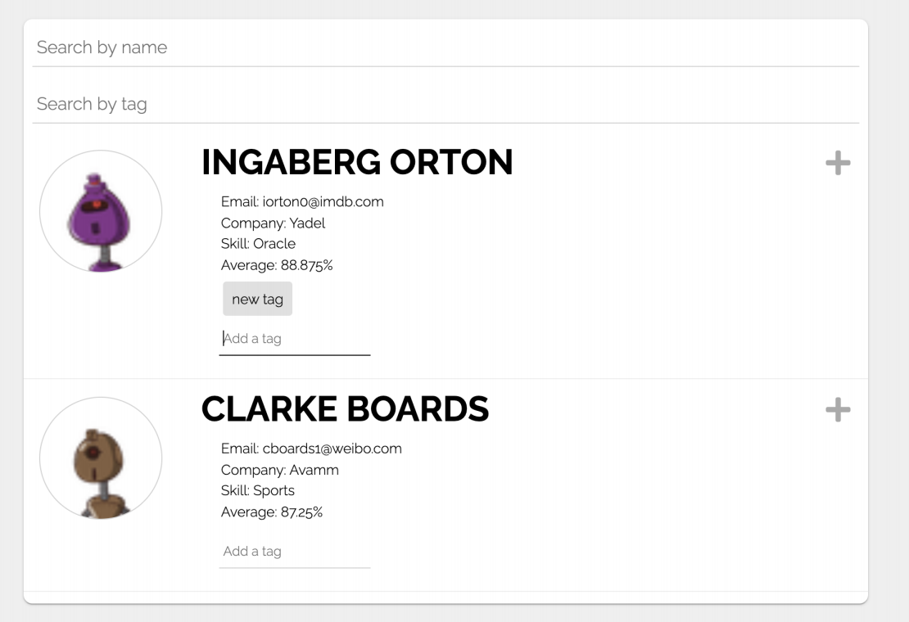

[](https://app.netlify.com/sites/mosaic-robots/deploys)

<!-- PROJECT LOGO -->
<br />
<p align="center">


  <h3 align="center">Mosaic's Test Assessment</h3>
</p>


<!-- TABLE OF CONTENTS -->
<details open="open">
  <summary>Table of Contents</summary>
  <ol>
    <li>
      <a href="#about-the-project">About The Project</a>
      <ul>
        <li><a href="#built-with">Built With</a></li>
      </ul>
    </li>
    <li>
      <a href="#getting-started">Getting Started</a>
      <ul>
        <li><a href="#prerequisites">Prerequisites</a></li>
        <li><a href="#installation">Installation</a></li>
      </ul>
    </li>
    <li><a href="#contact">Contact</a></li>
  </ol>
</details>


<!-- ABOUT THE PROJECT -->
## About The Project



The goal of this assessment is to replicate the frontend application as close as
possible. You are allowed to use any frontend framework (React.js, Vue.js, etc.) or use
plain Javascript, HTML, and CSS.


The first step of the assignment is to fetch data from this public JSON API, and present
the information on the screen.

The second step of the assignment is to style the web page.

Next, you are going to add a text input, where a user can filter the list of students
by their name (including full name!).

In the fourth step, you are going to make each student have an expandable list view, so that all
of their test scores may be viewed. 

Finally, you will add a text input field to add tags for a specific student. Here is what it
looks like (adding a tag called “new tag”):
You will then add another search bar to search for students based on tags. A strong
submission will have this functionality:
If a name is entered in the search by name input, and a tag is entered in the
search by tag input, results that include both the name and tag should be shown.


### Built With

* [React](https://reactjs.org/)
* [Redux](https://redux.js.org/)
* [redux-logic](https://github.com/jeffbski/redux-logic)
* [Typescript](https://www.typescriptlang.org/)
* [WebPack 5](https://webpack.js.org/)


<!-- GETTING STARTED -->
## Getting Started

### Prerequisites

* npm
  ```sh
  npm install npm@latest -g
  ```

* node.js
  ```sh
  npm install node@14.17.0
  ```
* yarn
  ```sh
  npm install yarn -g
  ```

### Installation

1. Install NPM packages
   ```sh
   yarn install
   ```
2. Install Husky
   ```sh
   yarn run prepare
   ```
3. Run the project
   ```sh
   yarn run start
   ```
4. Build the project
   ```sh
   yarn run build
   ```
<!-- CONTACT -->
## Contact

Alexey Ivanov - alexey.ivanov.js@gmail.com


<!-- MARKDOWN LINKS & IMAGES -->
[linkedin-shield]: https://img.shields.io/badge/-LinkedIn-black.svg?style=for-the-badge&logo=linkedin&colorB=555
[linkedin-url]: https://www.linkedin.com/in/alexey-ivanov-fcsmjs
